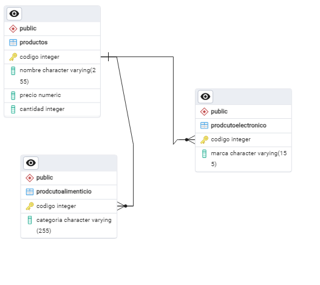

# Gestión de Productos

## Descripción

Este proyecto permite gestionar productos electrónicos y alimenticios utilizando una base de datos *PostgreSql* para almacenar y recuperar datos. Proporciona funcionalidades para agregar, buscar, actualizar y eliminar productos, así como mostrar todos los productos almacenados.

## Requisitos

- Python 3.x

## Instalación

1. Clona este repositorio o descarga los archivos necesarios.
2. Asegúrate de tener Python instalado en tu sistema y todas las dependencias necesarias.
3. Las depencias del proyecto se encontraran en el mismo, en un archivo `requirements.txt`.

## Uso

### Ejecución del programa

Para ejecutar el programa, simplemente corre el archivo `main.py`:

```sh
python main.py
```

## Funcionalidades

1. *Agregar Producto Electrónico*: Permite agregar un producto electrónico especificando código, nombre, precio, cantidad y marca.
2. *Agregar Producto Alimenticio*: Permite agregar un producto alimenticio especificando código, nombre, precio, cantidad y categoría.
3. *Buscar Producto por Código*: Permite buscar un producto existente por su código.
4. *Actualizar Producto:* Permite actualizar el precio de un producto existente.
5. *Eliminar Producto por Código*: Permite eliminar un producto existente por su código.
6. *Mostrar Todos los Productos*: Muestra todos los productos almacenados.
7. *Salir*: Salir del programa.

## Database schema
